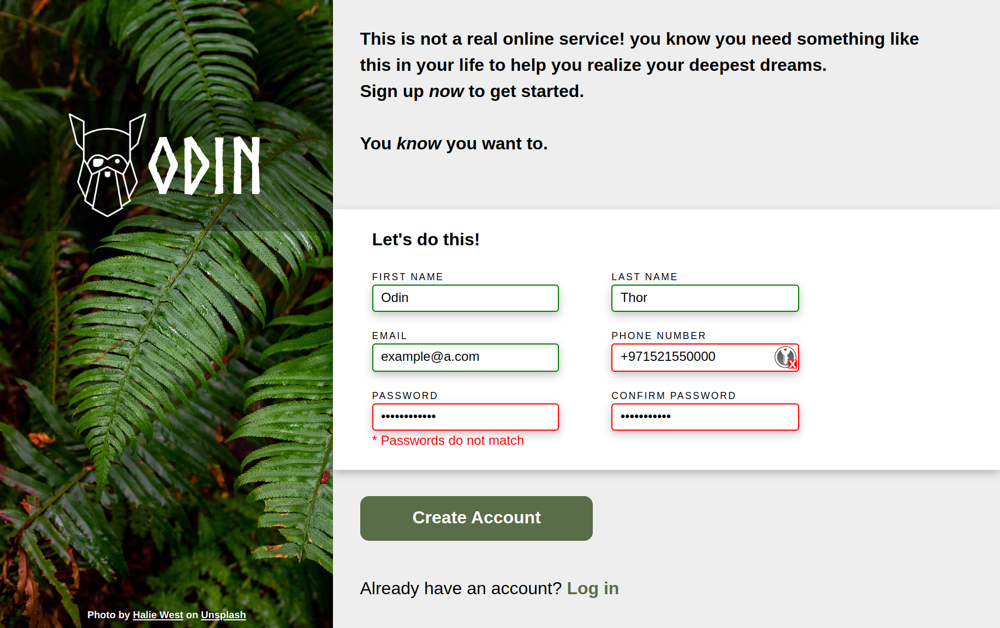

# Sign Up Form

Simple Sign up Form using pure HTML and CSS

## Demo

You can try it online [here](https://i4pg.github.io/sign-up-form).

## Features

* Responsive Desktop Screen Design
* Client-side instant validation using HTML, CSS and JS

## Showcase

### Screenshot

## Getting Started

### Usage

You can try it online [here](https://i4pg.github.io/sign-up-form).

### Installation

To run this program locally, you can clone the repository to your local machine using the following command:

`git clone https://github.com/i4pg/sign-up-form.git`

Then open the `index.html` file in your web browser to start playing the game.

### To-do

- [x] UI
    - [x] Desktop Screen responsive
    - [x] Cross-Browser
    - [x] Form validaiton instant feedback

## Contributing

Contributions to this project are welcome. To contribute, follow these steps:

1.  Fork this repository.
    
2.  Create a new branch with your changes:
    
    `git checkout -b my-new-branch`
3.  Make your changes and commit them:
    
    `git commit -am 'Add some feature'`
4.  Push your changes to your forked repository:
    
    `git push origin my-new-branch`
5.  Create a pull request on this repository.
    
## Acknowledgement

Project inspiration from [The Odin Project](https://www.theodinproject.com).

## License

This project is licensed under the MIT License. See the [LICENSE](LICENSE) file for details.
